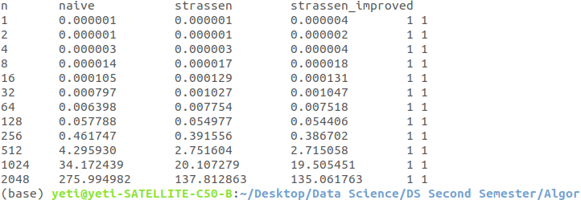

# Tuning usage of memory  for Strassen's Matrix Multiplication

## Objective:
 The objective of this exercise was to implement a method to improve the performance of the Strassen matrix multiplication . The idea of this implementation is to reduce the amount of auxillary memory usage by effectively reusing the temporary memory space.

## Overview:
The naive algorithm for multiplying two matrices has time complexity of `$ O(n^{3} $` but Strassen came up with this clever algorithm of multiplying two matrices which requires  7 multiplications and 18 addition/subtractions. So, the A and B (m*m) with m being even can be divided into blocks of m/2* m/2 matrices. The resulting product is received in matrix C. This has the complexity at O(n^{2.81}). By implementing certain methods , we can further improve time complexity and one of the way is to reduce the excessive amounts of memory usage to store temporary results. We used matrix `C` for temporary space by storing temporary variables in `C12` ,`C21` ,`C22`, `C11` so it required just two temporary variables.

The elapsed time for Naive  MM, Strassen MM and improved Strassen MM are computed and listed as :

Table 1: Showing the elapsed time results to compute matrix multiplication for different methods of MM .

The result shows that for large value of n , the improved Strassen algorithm wins the normal Strassen algortihm .

 ## Running the code:

 For compiling the codes ,`gcc -o4 -o strassen_test *.c -lrt ` command can be used; which will yield out the elapsed time for various MM methods implemented in this exercise.
