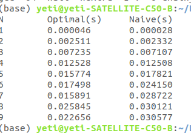

# Chain Matrix Multiplication

## Objective:
The objective of this exercise was to implement the iterative dynamic-programming algorithm to solve the chain matrix multiplication.

## Overview :
This folder contains dynamic programming algorithm for finding the optimal way of inserting parenthesis for chain matrix multiplication. In the code , we created two matrices named `m ` which holds the cost of  multiplication of matrices resulting from various combinations with diagonal holding value 0  and `s`  holds the index of matrix which gives the minimum cost  so that we can insert the parenthesis at that particular point.

The`matrix.c` and `matrix.h` contain  the basic common routines used for the implementation of the algorithm.  We evaluated  the performance of the algorithm on some examples and compared the execution time with the naive solution. The table containing the elapsed time has been captured as below:

## Compiling the code:
Makefile is provided which will allow us to compile  the code by using `make` command. The executable name `chain_test.x` will be produced.
